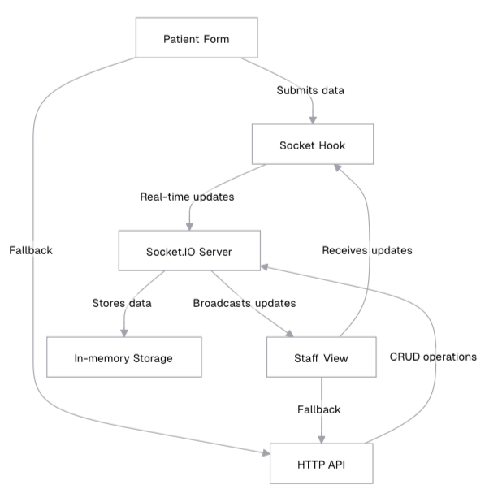
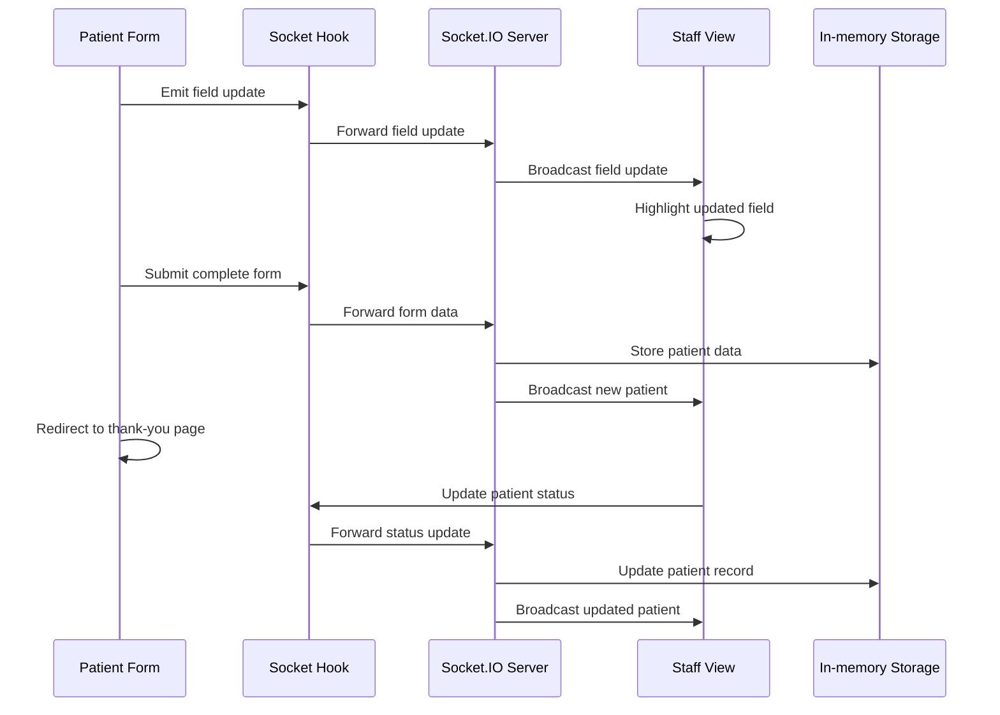

# Agnos

A real-time patient information management system that allows patients to submit their information through a form and staff members to view and manage patient data in real-time.

## Overview

This system provides a seamless way for healthcare facilities to collect and manage patient information. It features:

- Real-time form updates as patients type
- WebSocket-based synchronization with HTTP fallback
- Responsive design for all device sizes
- Offline capability with localStorage persistence
- Patient data editing functionality
- Status management for patient records

## Table of Contents

- [Setup Instructions](#setup-instructions)
- [Project Structure](#project-structure)
- [Design Decisions](#design-decisions)
- [Component Architecture](#component-architecture)
- [Real-Time Synchronization Flow](#real-time-synchronization-flow)
- [Bonus Features](#bonus-features)

## Setup Instructions

### Prerequisites

- Node.js 16.x or higher
- npm or yarn

### Installation

1. Clone the repository:

   ```bash
   git clone https://github.com/21Gxme/Agnos.git
   cd Agnos
    ```

2. Install dependencies:

    ```shellscript
    npm install
    # or
    yarn
    ```

3. Start the development server:

    ```shellscript
    npm run dev
    ```

4. Open your browser and navigate to `http://localhost:3000`

## Project Structure

```plaintext
patient-information-system/
├── app/                      # Next.js App Router
│   ├── api/                  # API routes for HTTP fallback
│   │   ├── patients/         # Patient data API endpoints
│   │   │   ├── [id]/         # Individual patient endpoints
│   │   │   │   └── route.ts  # GET/PUT for specific patient
│   │   │   └── route.ts      # GET/POST/PUT for all patients
│   ├── globals.css           # Global styles
│   ├── layout.tsx            # Root layout component
│   ├── page.tsx              # Home page
│   ├── patient-form/         # Patient form page
│   │   └── page.tsx          # Patient form component
│   ├── staff-view/           # Staff view page
│   │   └── page.tsx          # Staff dashboard component
│   └── thank-you/            # Thank you page after form submission
│       └── page.tsx          # Thank you component
├── components/               # Reusable components
│   ├── debug-panel.tsx       # Debug panel for development
│   ├── patient-form.tsx      # Patient form component (legacy)
│   ├── staff-view.tsx        # Staff view component (legacy)
│   └── ui/                   # UI components
│       └── toast.tsx         # Toast notification component
├── lib/                      # Utility functions and hooks
│   ├── useSocket.ts          # WebSocket hook
│   └── utils.ts              # Utility functions
├── public/                   # Static assets
├── scripts/                  # Helper scripts
│   └── test-socket.js        # Script to test WebSocket connection
├── server.js                 # Custom server with Socket.IO
├── tailwind.config.js        # Tailwind CSS configuration
├── package.json              # Project dependencies
└── vercel.json               # Vercel deployment configuration
```

## Design Decisions

### UI/UX Design Philosophy

The system follows a clean, minimalist design approach with a focus on usability and accessibility. The color scheme uses blue as the primary color to convey trust and professionalism, which is essential for healthcare applications.

### Responsive Design

The interface is fully responsive and optimized for different screen sizes:

#### Mobile (< 640px)

- Single column layout for forms and patient cards
- Stacked navigation elements
- Simplified patient information display
- Touch-friendly input elements with adequate spacing

#### Tablet (640px - 1024px)

- Two-column layout for forms where appropriate
- Semi-expanded patient information cards
- Tabbed navigation for patient filtering

#### Desktop (> 1024px)

- Multi-column layouts for efficient space utilization
- Expanded patient information cards with detailed information
- Side-by-side display of personal and contact information
- Full navigation bar with all options visible

### Accessibility Considerations

- Semantic HTML structure for screen readers
- Adequate color contrast for readability
- Keyboard navigation support
- Form validation with clear error messages
- ARIA attributes where appropriate

## Component Architecture

### Core Components

#### Patient Form (`app/patient-form/page.tsx`)

- **Purpose**: Collects patient information through a form interface
- **Features**:

  - Real-time data validation
  - Field-by-field error messaging
  - Real-time updates to staff view as patients type
  - Support for both new submissions and editing existing records
  - Offline capability with localStorage fallback

#### Staff View (`app/staff-view/page.tsx`)

- **Purpose**: Displays patient information for healthcare staff
- **Features**:

  - Real-time updates of patient information
  - Live form monitoring to see patients currently filling forms
  - Patient status management
  - Edit functionality for patient records

#### Socket Hook (`lib/useSocket.ts`)

- **Purpose**: Manages WebSocket connections for real-time updates
- **Features**:

  - Connection state management
  - Automatic reconnection
  - Transport fallback (WebSocket → HTTP polling)
  - Error handling

#### Server (`server.js`)

- **Purpose**: Custom Next.js server with Socket.IO integration
- **Features**:

  - WebSocket server implementation
  - In-memory data storage
  - Event handling for real-time updates
  - API route integration

### Component Relationships



This diagram represents the architecture and relationships between various components in a system that handles real-time updates, data storage, and communication between clients and a server.

This is an explanation of each component and its interactions:

### **Components**

1. **Patient Form**:
   - This is the client-side interface where users (e.g., patients) submit data.
   - It sends data to the server through the `Socket Hook`.

2. **Socket Hook**:
   - Acts as a communication layer between the client and the server.
   - Receives data from the `Patient Form` and forwards it to the `Socket.IO Server`.
   - Also receives updates from the server and sends them back to the client.

3. **Socket.IO Server**:
   - Handles real-time communication between the client and the server.
   - Sends real-time updates to the `Socket Hook` for the client.
   - Broadcasts updates to other components, such as the `Staff View`.
   - Provides a fallback mechanism for communication in case of issues.

4. **In-memory Storage**:
   - Temporarily stores data received from the `Socket.IO Server`.
   - Acts as a fast-access storage layer for the server.

5. **Staff View**:
   - Another client-side interface, typically used by staff members to monitor or interact with the system.
   - Receives real-time updates from the `Socket.IO Server`.
   - Can also send updates or requests back to the server.

6. **HTTP API**:
   - Provides a fallback mechanism for communication when real-time updates are not possible.
   - Handles CRUD (Create, Read, Update, Delete) operations on the data.
   - Interacts with the `In-memory Storage` to store or retrieve data.

### **Interactions**

1. **Data Submission**:
   - The `Patient Form` submits data to the `Socket Hook`, which forwards it to the `Socket.IO Server`.

2. **Real-time Updates**:
   - The `Socket.IO Server` sends real-time updates to the `Socket Hook` (for the `Patient Form`) and the `Staff View`.

3. **Broadcasting Updates**:
   - The `Socket.IO Server` broadcasts updates to multiple components, such as the `Staff View`.

4. **Data Storage**:
   - The `Socket.IO Server` stores data in the `In-memory Storage` for quick access.

5. **Fallback Mechanism**:
   - If real-time communication fails, the system falls back to the `HTTP API` for data submission and retrieval.
   - The `HTTP API` interacts with the `In-memory Storage` to perform CRUD operations.

6. **Staff Interaction**:
   - The `Staff View` receives updates from the `Socket.IO Server` and can also send updates or requests back to the server.

## Real-Time Synchronization Flow

The system implements a robust real-time synchronization mechanism with fallback strategies to ensure data integrity across different network conditions.

### WebSocket Communication Flow

1. **Connection Establishment**:

   1. Client connects to the server via Socket.IO
   2. Server acknowledges connection and assigns a socket ID
   3. Server sends initial patient data to the client

2. **Real-time Form Updates**:

   1. As patients type in the form, field changes are emitted to the server
   2. Server broadcasts these updates to staff view clients
   3. Staff view highlights the fields being updated in real-time

3. **Form Submission**:

    1. Patient completes and submits the form
    2. Form data is emitted to the server via WebSocket
    3. Server adds the patient to the in-memory storage
    4. Server broadcasts the new patient to all connected staff clients
    5. Patient is redirected to a thank-you page

4. **Patient Updates**:

   1. Staff can update patient status or edit patient information
   2. Updates are emitted to the server via WebSocket
   3. Server updates the patient in the in-memory storage
   4. Server broadcasts the updated patient to all connected clients

This multi-layered approach ensures the system remains functional across various network conditions and environments.

### Synchronization Sequence



## Bonus Features

### 1. Real-time Field Highlighting

The staff view highlights fields that patients are currently typing in, providing immediate visual feedback about which information is being entered or modified.

### 2. Multi-layered Fallback System

The application implements a sophisticated fallback system that gracefully degrades from WebSockets to HTTP polling to localStorage, ensuring functionality across various network conditions.

### 3. Patient Editing

Staff members can edit patient information, with changes reflected in real-time across all connected clients.

## Component Architecture

### Key Components and Their Responsibilities

#### Patient Form Component

**Purpose**: Collects and validates patient information

**Key Features**:

- Form validation with field-specific error messages
- Real-time data emission as fields are updated
- Support for both new submissions and editing existing records

**State Management**:

- Form data state with all patient fields
- Validation errors state
- Submission status state
- Editing mode state

**Key Methods**:

- `handleChange`: Updates form state and emits real-time updates
- `validateForm`: Performs validation on all form fields
- `handleSubmit`: Processes form submission with fallback strategies

#### Staff View Component

**Purpose**: Displays and manages patient information

**Key Features**:

- Real-time updates of patient information
- Filtering by patient status
- Live form monitoring
- Patient status management

**State Management**:

- Patients array state
- Active tab state (all, submitted, active)
- Live forms state for real-time monitoring
- Last updated field tracking for highlighting

**Key Methods**:

- `handleStatusChange`: Updates patient status
- `handleEditPatient`: Navigates to edit mode for a patient
- `getFieldLabel`: Converts field names to human-readable labels

#### Socket Hook

**Purpose**: Manages WebSocket connections

**Key Features**:

- Connection state management
- Automatic reconnection
- Transport fallback
- Error handling

**State Management**:

- Connection status state
- Error state

**Key Methods**:

- `emitFormUpdate`: Sends form updates to the server
- `updatePatient`: Sends patient updates to the server

### Component Interaction Patterns

#### Data Flow

1. **Unidirectional Data Flow**:

   1. State changes flow down through props
   2. Events flow up through callbacks
   3. Socket events provide real-time updates

2. **Event-Driven Architecture**:

   1. Components respond to socket events
   2. UI updates are triggered by state changes

#### Component Communication

1. **Parent-Child Communication**:

   1. Props passed down from parent to child
   2. Callback functions passed up from child to parent

2. **Socket-Based Communication**:

   1. Components subscribe to relevant socket events
   2. Components emit events when data changes

## Real-Time Synchronization Flow

### WebSocket Implementation

The system uses Socket.IO for real-time communication, which provides:

1. **Automatic reconnection**: If connection is lost, Socket.IO attempts to reconnect automatically
2. **Transport fallback**: Starts with WebSocket, falls back to HTTP long-polling if WebSocket is unavailable
3. **Room-based broadcasting**: Allows targeting specific clients or groups

### Event Types

1. **Connection Events**:

   1. `connect`: Client successfully connected to server
   2. `disconnect`: Client disconnected from server
   3. `connect_error`: Connection error occurred

2. **Data Events**:

   1. `initial-patients`: Server sends initial patient data to client
   2. `patient:new`: New patient submitted
   3. `patient:updated`: Existing patient updated
   4. `form:live-update`: Real-time form field updates
   5. `form:inactive`: Form session ended

### Synchronization Process

#### Initial Load

1. Client connects to WebSocket server
2. Server sends `initial-patients` event with all patient data
3. Client populates UI with received data

#### Real-time Updates

1. **Form Updates**:

   1. Patient types in form field
   2. Client emits `form:update` event with field data
   3. Server broadcasts to staff clients
   4. Staff view highlights updated field

2. **Form Submission**:

   1. Patient submits complete form
   2. Client emits `patient:submit` event
   3. Server adds patient to storage
   4. Server broadcasts `patient:new` to all clients
   5. Staff view adds new patient to list

3. **Patient Updates**:

   1. Staff changes patient status
   2. Client emits `patient:update` event
   3. Server updates patient in storage
   4. Server broadcasts `patient:updated` to all clients
   5. All clients update patient information

### Fallback Strategy

The system implements a progressive fallback strategy:

1. **Primary: WebSocket**

   1. Real-time bidirectional communication
   2. Lowest latency, most efficient

2. **Secondary: HTTP Long-Polling**

   1. Automatically used if WebSocket fails
   2. Still provides near-real-time updates

3. **Tertiary: HTTP API**

   1. Used if Socket.IO connection fails entirely
   2. Standard RESTful API calls

4. **Quaternary: localStorage**

   1. Used if server is unreachable
   2. Allows offline operation
   3. Synchronizes when connection is restored

### Performance Considerations

1. **Throttling**:

   1. Real-time updates are throttled to prevent overwhelming the server
   2. Debouncing of form field updates

2. **Selective Broadcasting**:

   1. Updates are only sent to clients that need them
   2. Field-specific updates rather than entire form data

3. **Payload Optimization**:

   1. Minimal data sent over the wire
   2. Differential updates where possible

---
[Agnos](https://agnos-mauve.vercel.app/) This link is link to my project. But I don't know why it doesn't work. I will try to fix it. If you want to see my project, please run it on your local machine.
